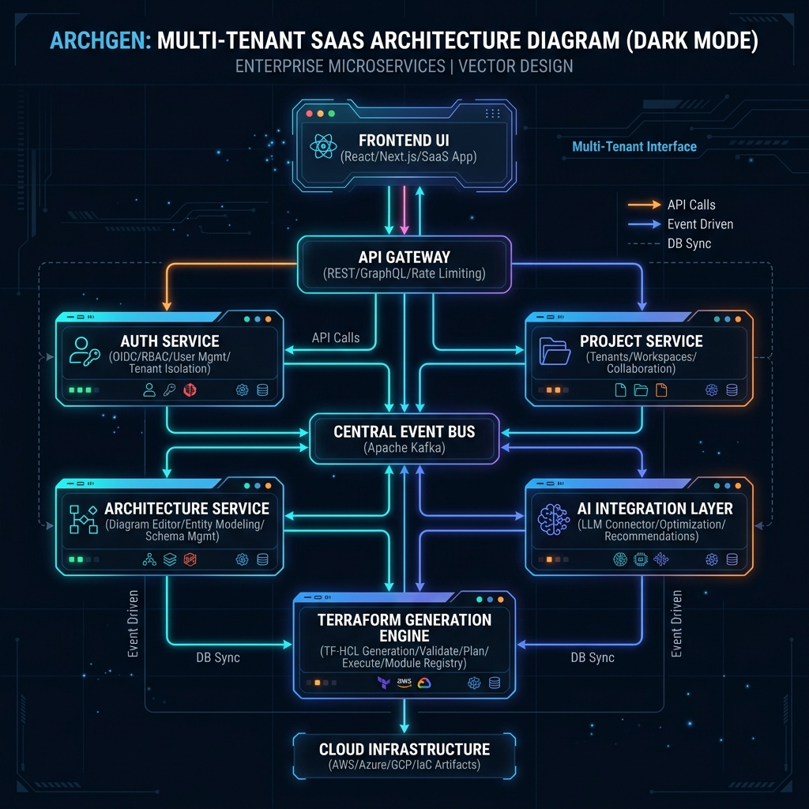
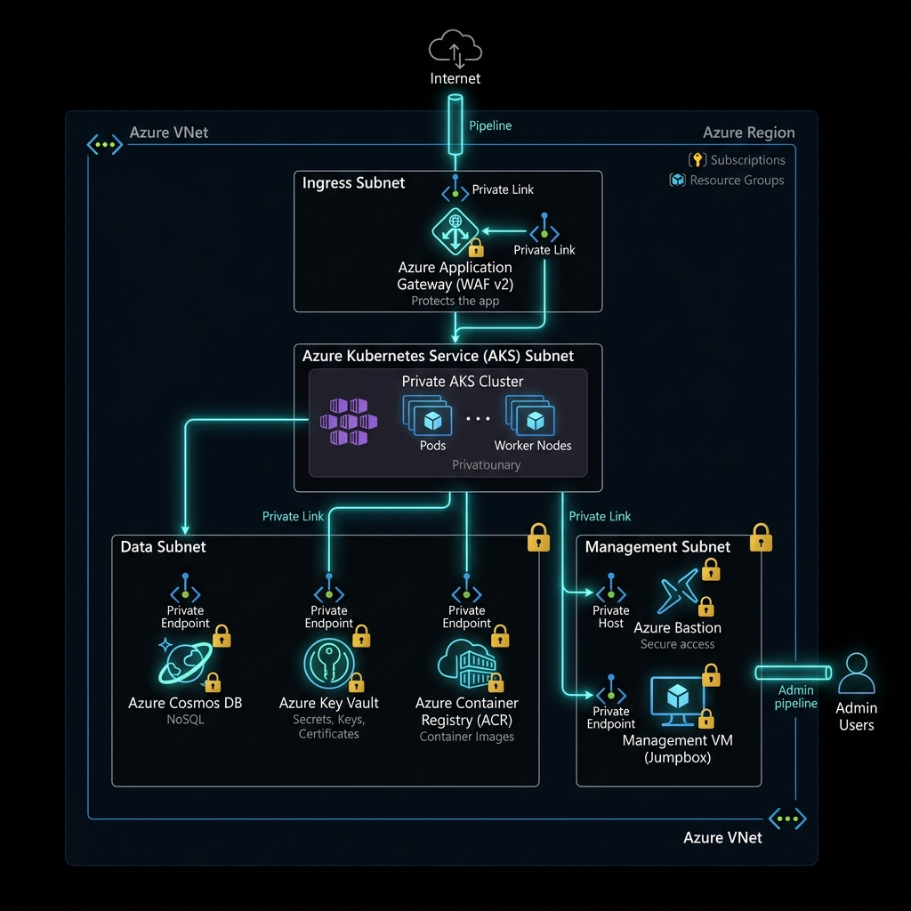
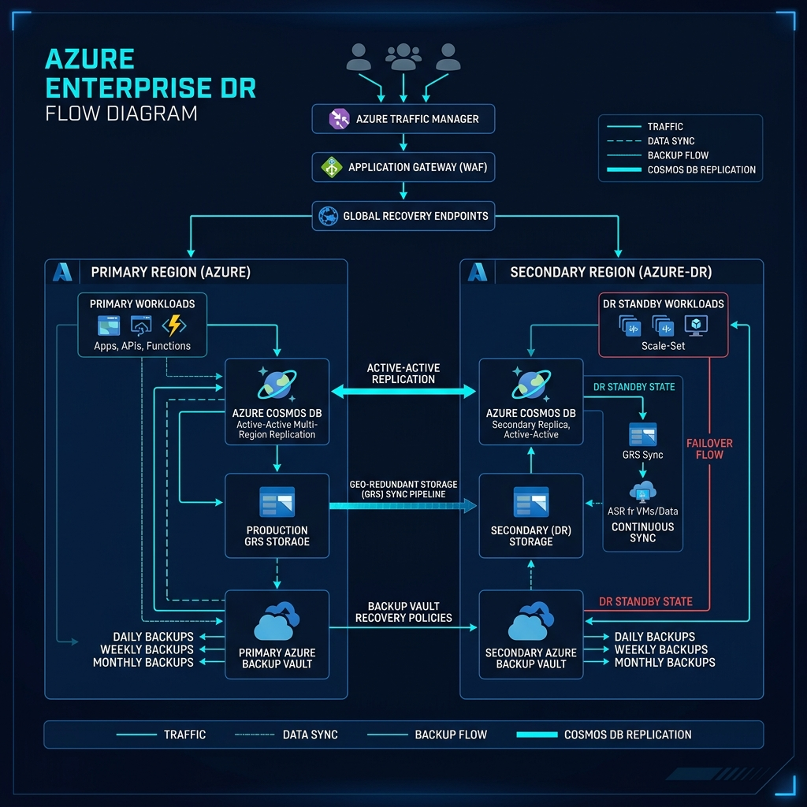

# ArchGen Enterprise Infrastructure (Azure Deployment)

This directory contains the production-grade, enterprise-scale infrastructure definitions for the **ArchGen Platform** on Microsoft Azure.

---

## 1. Project Overview

### Application Overview
**ArchGen** is an AI-powered architecture orchestration and deployment engine. Users visually compose cloud topologies, run security audit pipelines, optimize monthly workloads (FinOps), and compile deployable, multivariable Terraform stacks.

### Architecture Overview
The platform is designed around a fully containerized, microservices-oriented layout deployed inside a **Private Azure Kubernetes Service (AKS)** cluster. All internal components communicate privately within an Azure Virtual Network (VNet), guarded by Application Gateway Web Application Firewall (WAF) rules at ingress, and private link endpoints at the database/storage layers.

---

## 2. Visual Topologies & Diagrams

### Application Architecture Diagram
This diagram shows the microservices layout (Frontend, API Gateway, Auth, Project, Architecture Services, AI Layer, and HCL compiler engine) and their communication lines.



### Azure Cloud Architecture Diagram
This diagram shows the Virtual Network (VNet) boundaries, dynamic subnets, Bastion host, private management VM, private endpoints, and security/monitoring services.



### Disaster Recovery Diagram
This diagram visualizes Cosmos DB active-active geo-replication, geo-redundant storage sync pipelines, and backup vault recoveries.



---

## 3. Terraform Module Hierarchy

The infrastructure is written using fully reusable, decoupled Terraform modules:

```
infrastructure/terraform/
├── versions.tf                 # Global pinned versions (Terraform >= 1.8.0, azurerm >= 4.0)
├── providers.tf                # Default Azure provider declarations
├── backend/                    # Separate state backend setup
│   ├── main.tf                 # RG-TFSTATE, Storage account, locking containers
│   ├── variables.tf
│   └── outputs.tf
├── modules/
│   ├── resource-group/         # Standardized Resource Group creator
│   ├── networking/             # Loops (for_each) dynamically creating subnets, NSGs, and RTs
│   ├── aks/                    # Private AKS cluster (Azure CNI, Autoscaler, OIDC Workload Identity)
│   ├── acr/                    # Premium Container Registry (AcrPull AKS integration)
│   ├── cosmosdb/               # Cosmos DB (Multi-Region Replication, HA)
│   ├── keyvault/               # Key Vault (CSI secrets provider & Azure RBAC)
│   ├── application-gateway/    # Application Gateway WAF v2 & AGIC
│   ├── bastion/                # Azure Bastion Host for secure tunneling
│   ├── vm/                     # Private Management VM for kubectl admin
│   ├── monitoring/             # Log Analytics, Managed Prometheus & Grafana
│   ├── backup/                 # RSV + Backup vaults (GRS)
│   └── private-endpoints/      # Generic endpoint linking module for PaaS services
└── environments/               # Environment orchestrator workspaces
    ├── dev/                    # Development (dev.tfstate, 10.10.0.0/16)
    └── prod/                   # Production (prod.tfstate, 10.30.0.0/16)
```

---

## 4. Helm Chart Structure

Each microservice is versioned and deployed using its own dedicated Helm chart under `infrastructure/helm/`:

```
infrastructure/helm/
├── frontend/                   # Frontend SPA UI Chart (AGIC Ingress, HPA, ClusterIP)
│   ├── Chart.yaml
│   ├── values.yaml
│   └── templates/ (deployment.yaml, service.yaml, ingress.yaml, hpa.yaml)
├── api-gateway/                # API Gateway Ingress Routing Chart
│   ├── Chart.yaml
│   ├── values.yaml
│   └── templates/
├── auth-service/               # Auth Microservice (Key Vault CSI Secrets mounted, Workload Identity)
│   ├── Chart.yaml
│   ├── values.yaml
│   └── templates/ (deployment.yaml, service.yaml, serviceaccount.yaml, secrets-provider.yaml, hpa.yaml)
├── project-service/            # Project Metadata Service (Cosmos DB secrets provider, Workload Identity)
│   ├── Chart.yaml
│   ├── values.yaml
│   └── templates/
└── architecture-service/       # Agent Engine (LLM API keys mounted, autoscaling user pool)
    ├── Chart.yaml
    ├── values.yaml
    └── templates/
```

---

## 5. Architectural Blueprints

### AKS Deployment Architecture
- **Isolation**: Cluster is strictly **private** (`private_cluster_enabled = true`). Direct access to the API server is blocked from the internet. All administration is performed from the private Management VM via Azure Bastion tunneling.
- **CNI Integration**: Azure CNI handles Pod-to-VNet IP allocation, enabling pods to talk directly to Azure resources with low latency.
- **Service Accounts**: Pods leverage **Azure Workload Identity** and are bound to specific `ServiceAccounts` annotated with client IDs, eliminating static token storage.

### Security Architecture
- **Inbound Gate**: An **Azure Application Gateway WAF v2** handles public TLS termination and runs custom prevention rulesets (OWASP 3.2).
- **Secrets Management**: Secrets are stored in **Azure Key Vault** with public endpoint access disabled. Pods mount secrets dynamically into local RAM volumes using the **Key Vault CSI Secret Store Driver** linked via workload identities. No secrets are stored in Kubernetes manifests or code.
- **Private Link Boundaries**: Cosmos DB, Key Vault, and ACR communicate only over Private Endpoints inside `subnet-pe`, bound to private Azure DNS Zones.

### Monitoring & Observability
- **Logs**: AKS container stdout/stderr, App Gateway logs, and diagnostic metrics flow into a central **Log Analytics Workspace**.
- **Metrics**: Pod telemetry and cluster resources are scraped by **Azure Managed Prometheus**.
- **Visual Dashboards**: Developers access real-time dashboards via **Azure Managed Grafana** linked directly to the Prometheus workspace.

### Terraform Backend Architecture
- State files are stored in a dedicated, isolated resource group: **`RG-TFSTATE`**.
- Uses an Azure Storage Account with GRS (Geo-Redundant Storage), Versioning enabled for state rollback, blob soft delete, and state locking to prevent write conflicts. State configurations are separated into `dev.tfstate` and `prod.tfstate` files.
